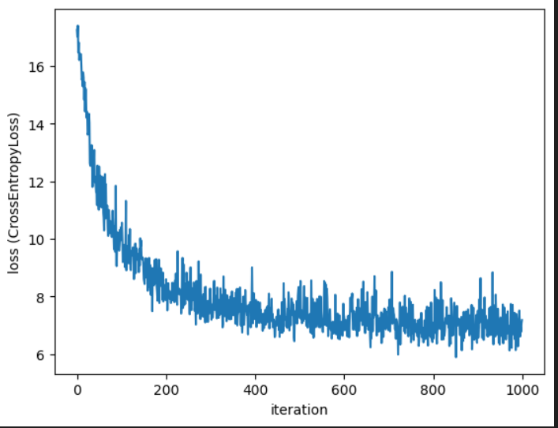

# README: 

This repository contains code and an interface for creating, training, and querying a naive generative pretrained transformer from scratch.
Built as part of MATH498 - Decoding GPT. Colorado School of Mines, Spring 2026.

**Authors:** Jesan Ahammed Ovi, Stone Amsbaugh  
**Instructor:** Michael Ivanitsky

---

## Table of Contents

- [Overview](#overview)
- [Repository Contents](#repository-contents)
- [Using the Project](#using-the-project)
  - [Environment Setup](#environment-setup)
  - [Initializing a Model](#initializing-a-model)
  - [Training a Model](#training-a-model)
  - [Querying a Model](#querying-a-model)
  - [Saving a Model](#saving-a-model)
  - [Loading a Model](#loading-a-model)
  - [Chatting with a Model](#chatting-with-a-model)
- [Project Structure](#project-structure)
  - [Config](#config)
  - [Vocab](#vocab)
  - [MLP](#mlp)
  - [Attention](#attention)
  - [Transformer](#transformer)
  - [LanguageModel](#languagemodel)
  - [GPT Object](#gpt-object)
- [Evaluation](#evaluation)
  - [Results](#results)
  - [Design Choices, Challenges, Future Direction](#design-choices-challenges-future-direction)
    - [Challenges Faced During GPT Implementation](#challenges-faced-during-gpt-implementation)
    - [Design Choices](#design-choices)
    - [Future Work](#future-work)
  - [Collaboration](#collaboration)
- [Attribution](#attribution)

---

## Overview

In MATH498, we have covered the basic mathematical foundation on top of which GPTs (Generative Pretrained Transformers) are constructed. In this assignment, we utilize PyTorch and the math we have learned to implement a GPT language model.

## Repository Contents

For the purposes of navigating this repository, consider the following contents:

* **README.md:** That is this document. It describes the project and documents its functionality. Take a look around.
* **master_utility.py:** This document defines all classes and functions that can be used to create, train and query a GPT. All math and logic behind the model lives here.
* **gpt_demo.ipynb:** This is a **very** useful demonstration on how to use the GPT interface to train and use your own GPT model.
* **pyproject.toml**, uv.lock: This file is created by uv, the package manager used to develop this project. Among other things, it contains the dependencies for this project.
* **texts:** This directory should contain text files used for training the model. It comes with `recipes.txt`, which is a text dataset of many recipes that can be used for training (the text has many non-standard characters, and as a result performance is poor). If you use the default functionality to get the state of the union addresses for training the model, they will be downloaded to this directory.
* **models:** This direcotry contains saved models and vocabulary files. The models are the actual parameters that the model learns, and the vocabulary file contains the tokens it has learned and their IDs. Both of these are saved/loaded together when calling save/load functions, so you don't need to worry about them separately.
* **unit_tests.py:** This file contains unit tests that test all of the functionality defined in `master_utility.py`.
* **other:** There is largely no need to examine this directory. This directory contains old python files, notebooks, and other work that was used to develop and experiment as this project was created. It is saved as a reference for the work process and in case we want to dig up an old feature.
* **media:** This folder contains any media needed for the repository, which at the moment is just the loss plot included in this document.

## Using the Project

Here we will describe the high-level functionality of the project, which lives in `master_utility.txt`. This is what you need to use our interface, without understanding the inner workings.

This section will be very similar to `gpt_demo.ipynb`, which is perhaps a better resource for learning how to use this interface If you wish to use that instead, you will follow a similar process by running each cell. It is recommended that you follow that guide.

### Environment Setup

We recommend running this project with uv, but it is not required. If you opt not to use uv, ensure that your environment is set up with the packages listed as dependencies in 'pyproject.toml'.

To install and get started with uv, see: [https://github.com/astral-sh/uv](https://github.com/astral-sh/uv)

You can run:
```
uv sync
```
To install the project dependencies.

Before running a notebook, like `gpt_demo.ipynb`, you will need to select the kernel to use (top-right corner in VSCode), which will be under the virtual environment created by uv. To run a normal python script that you may create, use:
```
uv run my_script.py
```

To run the tests, use:
```
uv run pytest unit_tests.py -v
```

If you are going to experiment with the following usage instructions, it is recommended you do so in a Jupyter notebook.

### Initializing a Model

Your model starts with a GPT object, which can be initialized with:
```
my_gpt = GPT()
```
### Training a Model

You can train a model by providing the training method the number of iterations and a text file to train on. 
```
my_gpt.train(n_iter = 1000, text_file='texts/recipes.txt')
```
#### Notes:
* You can use the following built-in method to grab and downlaod a text file containing every State of the Union address through 2024. 
```
path = Vocab.get_state_of_union_file()
```
The 'path' symbol can then be passed to the training method as the 'text_file' argument.
* The training text must be at least as long as max_seq_len, which unless you modify is 256. For ideal results, the training text should be much larger than this.

#### Options:
These additional options are also implemented, and can be used if desired:
* **plain_text:** If plain_text (a string) is set and text_file is not, the model will train on your string
* **update:** Every 'update' number of iterations, the program will print an update including the iteration number and the loss. If set to 0, no updates will be given. Defaults to 50.
* **plot:** If True, will display a plot of the training loss over each iteration at the end of training. Default is True.
* **sample_prompt:** If set, will query the model before and after training with this prompt (a string) and print the results. Default is None, in which case no querying will be done during training.

### Querying a Model

You can query a model with the method:
```
my_gpt.query("My query for my gpt...", out_tokens=15)
```
The return will be a string, the models response.

#### Notes:
* If the query contains tokens the model has never seen, they will be ignored.

#### Options:
* out_tokens: An integer, the number of tokens (loosely similar to the number of words) that will be outputted from the model. Default is 15.
* sampling: One of "multinomial" or "greedy". "greedy" sampling will always choose the next token that has the highest computed probability, and is therefore repetetive and prone to being caught in loops. "multinomial" sampling is the default, and chooses a random token weighted on their computed probabilities, resulting in much more natural results.
* to_print: A boolean, default is False, but if True it will print the result in addition to simply returning it.

### Saving a Model
A model can be saved with:
```
my_gpt.save('my_gpt')
```
This only takes one parameter, the name of the model. 

#### Notes:
* The model name is not a path, just a string 'name' for the model. The model parameters will be saved to `./models/{name}.mdl` and the model's vocabular will be saved to `./models/{name}.vcb`.
* The user does not need to worry about these saved files or the fact that they are separate, they will be loaded correctly with just the name.

### Loading a Model
To load a previously saved model, we initialize a GPT object with the static method:
```
my_gpt = GPT.load_gpt_from('my_gpt')
```
Again, this only takes one parameter, the model name as a string that you wish to load.

### Chatting with a Model
To 'chat' with a model (which is nothing more than a nice interface to repeatedly query a model and see results), use:
```
my_gpt.chat()
```
Minus the prompt (and to_print), it takes the same parameters as the query method.

When run as a python script, this will initiatie a command line interface where you can converse with your model. When run inside of a Jupyter notebook, it will produce a widget that emulates the same interface.

## Project Structure
This section describes the internal architecture of the project. If you are simply using the interface, you do not need to understand every detail here. However, if you wish to modify the model, or understand how everything fits together, this section outlines the details of the implementation.

### Config
The config class is a simple `@dataclass` that stores all hyperparameters required to define the model. These include:

* `d_model`: The dimension of embedded tokens.
* `d_vocab`: The vocabulary length.
* `d_hidden`: The hidden layer size in the MLP.
* `max_seq_len`: The 'batch size' in tokens when training.
* `n_layers`: Number of transformer layers.

This object is passed into all major model components so they share a consistent specification. The `GPT` object has a `get_config()` and `set_config()` so users can modify hyperparameters.

### Vocab
The `Vocab` class implements all functionality related to tokenization and vocabulary. It is responsible for:
* Reading text from file
* Cleaning and tokenizing text
* Creating forward and backward token-ID mappings
* Converting tokens to token IDs and backwards.
* Expanding the vocabulary when new tokens are introduced
* Saving and loading vocabulary files (`.vcb`)
* A static utility method is also provided to download and process the full State of the Union dataset from Kaggle.

### MLP:
The `MLP` class (a `nn.Module`) defines the neural network used inside a transformer.

### Attention
The `Attention` class implements a single attention head.

Key components include:
- Learnable parameter matrices:
  - `Wqk` for computing query-key interactions
  - `Wov` for projecting attention outputs
- A mask matrix `M` registered as a buffer to prevent tokens from caring about future tokens

The forward pass applies the main formula relating to attention from class. This allows the model to care about previous tokens in a way where it can select which ones to actually care about.

### Transformer
The `Transformer` class combines:
- One `Attention` module
- One `MLP` module
- Two normalization layers

### LanguageModel
The `LanguageModel` class contains the full fundamental architecture. It includes:
- A token embedding layer
- A positional embedding layer
- `Transformer` blocks
- A final layer (`lm_head`) that outputs vocabulary logits

The forward pass:
1. Converts token IDs into embeddings
2. Adds positional embeddings
3. Passes it through each transformer layer
4. Outputs the resulting logits (log odds of each token in vocabulary coming next).

### GPT Object
The `GPT` class is the high-level object that a user interacts with. It includes:
- A `Vocab` instance
- A `Config` object
- A `LanguageModel` instance

It provides functionality like:
- Training (`train`)
- Generation (`query`)
- Interactive chat (`chat`)
- Saving and loading models

The `GPT` object hides the complexity of the model and makes a clean interface for users. 

## Evaluation

This section is for grading purposes, as this repository is also an assignment (Hi Michael).

Per the 'Evaluation Criteria' checklist on this assignment, this checklist aims to ensure all essential components of this project are included.
1. The README. This file properly documents everything in the repository. Particularly, see the sections [Repository Contents](#repository-contents), [Using the Project](#using-the-project) and [Project Structure](#project-structure).
2. The code does indeed run. Don't believe us? Try it yourself by running the cells in `gpt_demo.ipynb` or by running all 111 unit tests with the command:
```
uv run pytest unit_tests.py -v
```
3. Required architecture:
  * **Attention:** Implemented on line 241 in `master_utility.py`.
  * **Tokenization:** This is the primary function of the 'Vocab' class in `master_utility.py`. Specifically, see the functions `get_token_arr`, `get_token_ids`, and `set_dictionaries`.
  * **Training Loop and Loss:** The training loop starts on line 369 in `master_utility.py`. Loss is implemented with `nn.CrossEntropyLoss`.
  * **Generation:** Generation occurs in the `query(prompt, out_tokens)` method of a GPT object. It can be found at line 395 in `master_utility.py`. 
  * **Configurable Hyperparameters:** A user can set the model hyperparameters with the `set_config(config)` method defined at line 316 in `master_utility.py`. 
4. Results: 
  * A loss plot, expample generations, and analysis of these results is included in the [results section](#results).
  * The requested writeup regarding challenges, choices, future work can be found [here](#design-choices-challenges-future-direction).
  * Our contributions are outlined [here](#collaboration).

### Results
The following results come from an execution of the code in `gpt_demo.ipynb`, where you can reproduce similar results.

First, consider the response of an untrained model when asked to: "talk about the economy, inflation, and unemployment."
```20683317 panamericanism. into. earth 25205669. rico. codified courts codified 183303```
Then, the model was trained for 10,000 iterations on the state of the union addresses. The loss curve is presented below.
<br>

<br>
The following response was observed when given the same prompt as before:

```some greenbacks and deficit this so year. inland support will obvious of in a of```

As can be seen, qualitatively by the improvement in the response, and quantitatively by the substantial drop in loss, the models parameters do create a better model. The loss does however seem to plateau after around 500 iterations, so I would not expect substantial improvement in the model with more time to train.

### Design Choices, Challenges, Future Direction

#### Challenges Faced During GPT Implementation

  One of the primary challenges we faced during the implementation was deciding <b>where to begin the coding process</b>. Initially, we started with input preprocessing tasks such as text cleaning, tokenization, and embedding. However, this approach made it difficult to understand how the processed inputs would eventually flow into the Transformer architecture. As a result, we struggled to connect early-stage components with the attention and Transformer layers. With guidance from the course instructor, we adopted a more structured, bottom-up approach: first implementing a simple MLP, then building the attention mechanism, followed by the Transformer layer, and finally integrating everything into a unified LanguageModel class. Only after this structural foundation was complete did we focus on input processing, training loops, and text generation. This change in strategy resolved much of our confusion and led to significant progress, ultimately allowing us to complete the project successfully.

  Another major challenge arose while implementing the self-attention mechanism, particularly in handling the dimensions of the attention mask matrix (commonly referred to as the M matrix). Since the shape of the input tensor X can vary between training and inference—especially with different sequence lengths—it was nontrivial to ensure that the mask matrix always had compatible dimensions. Several runtime errors and incorrect attention behaviors stemmed from this issue, requiring careful reasoning about tensor shapes and broadcasting rules.

  A further difficulty we encountered was related to <b>training stability</b>. At the beginning of training, the loss values were extremely large (on the order of six digits), even though they decreased steadily with each iteration. While this behavior initially seemed alarming, we later addressed it by incorporating a normalization layer within the Transformer architecture. Normalization helped stabilize the activations by transforming arbitrarily large or small values into a more well-behaved distribution, which significantly improved training dynamics and overall model performance.

#### Design Choices

  The entire `master_utility.py` file is full of careful design desicions, and is the result of many refactorings and previous versions of code. One of the most notable design decisions, that may have been for the better or worse, was the design of the Vocab class.

  We decided that we needed a way to represent the vocabulary of a model, which includes the words that a model knows, its dimension, and a mapping of each token to its id (and the reverse). For this, we created a class that encapsulated these values (dictionaries), as well as useful methods for working with these tokens. There ended up being a lot of them, so I am happy with the class. However, I am still unsure of what the better way to do this would be, as the size of the vocabulary changes (say you train a model on one dataset then another), the dimension of your vocabulary changes and the size of your embedding matrices needs to change as well. So, we have several methods that re-declare these matrices, when the size changes, and even a refresh method. It is technically part of the config, as we were told to do it in class, but the model will overwrite this parameter to match the actual dimensions of the vocabulary it has.

  Additional design decisions is the whole hierarchy of mlp/attention/transformer/language model classes, that all extend the nn.module in the necessary way and contain instances of each other. We created a GPT class in addition to these that encapsulates all the operations a user would need to perform.

#### Future Work

  Future work will primarily involve two things.
  1. Tune hyperparameters and model architecture. For most models, this interface expects you to be using the same hyperparameters such as the number of hidden layers and number of transformer layers (while they are able to be user-specified). Tuning these parameters for certain purposes, as well as the overall model architecture, might lead to better results or reduced training time.
  2. Implement more accurate representations of how GPTs are actually implemented. As of writing this, we have already learned about multi-headed attention and byte-pair encoding, and there are many more features like this to come that may be implemented on this framework.

### Collaboration

This project was completed by Jesan Ahammed Ovi and Stone Amsbaugh. Both team members contributed significantly to the final product and hold a deep understanding of how it works.

During class, both members worked on implementing the content learned in class. Jesan was most responsible for the initial success of the attention head mechanism and the architecture of the LanguageModel class. He also implemented the feed-forward method, training loop and generation method.

Stone was primarily involved in building out the project, and was responsible for the project structure, creating a complete and easily-useable interface, implementing tokenizers and the vocabulary objects, saving and loading models, and documentation.

Generative AI was used for exactly 2 parts of this project.
1. As suggested by the instructor, the unit tests for the project were written by Claude using PyTest. This was a huge advantage for the project, as 111 unit tests were written, which is more than the authors would have been able to produce. Additionally, many of the tests were failing additionally. None of the test cases were modified - the current code now passes all test cases, as a result of debugging using these test cases
2. The command line interface for 'chatting' with the model looks bad when running in a Jupyter notebook. This is because it prompts the user for input at the very top of the screen- it no longer looks like a CLI. ChatGPT was used to assist in creating different interface that more accurately reflects the authors vision.

## Attribution

This repository contains recipes data that comes from this [repository](https://github.com/josephrmartinez/recipe-dataset). It is licensed under [CC BY-SA 3.0](https://creativecommons.org/licenses/by-sa/3.0/).

The project also has a builtin function to download State of the Union text from [this kaggle dataset](https://www.kaggle.com/datasets/nicholasheyerdahl/state-of-the-union-address-texts-1790-2024). It has the folllowing [MIT license](https://www.mit.edu/~amini/LICENSE.md).
